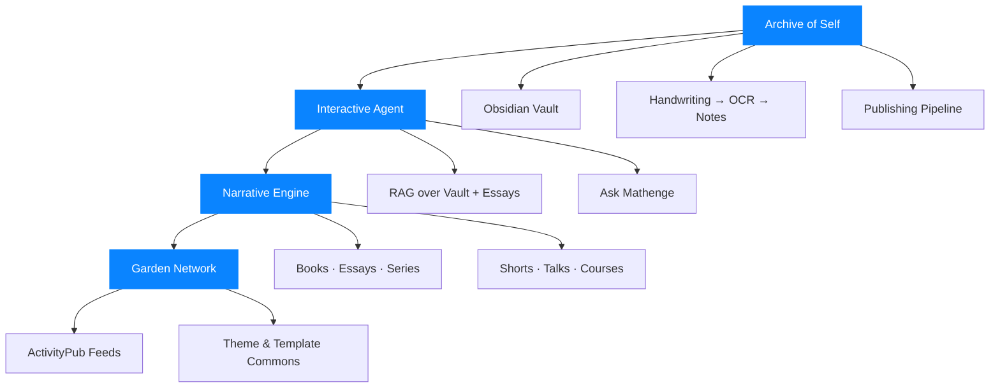
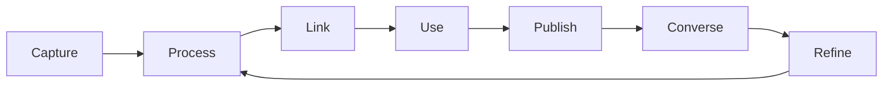
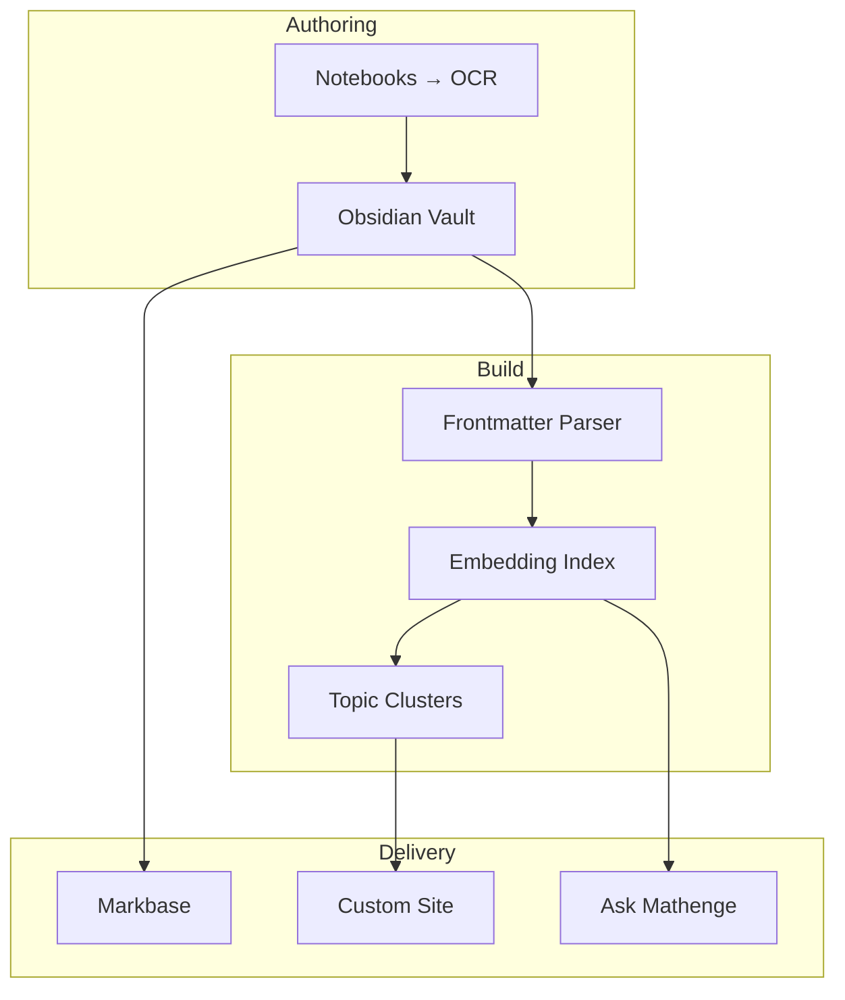
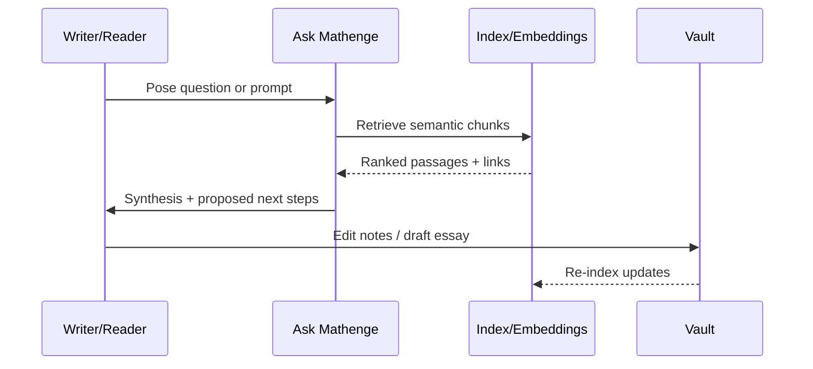

---
{"dg-publish":true,"permalink":"/content/essays/mathnuscripts-a-living-system-of-mind/","noteIcon":"2"}
---

# Mathnuscripts — A Living System of Mind

The `Mathnuscripts` are not a website, a set of notes, or a productivity hack. They are a living system of mind—an ecology where memory, meaning, and making reinforce one another until ideas become persons that act in the world. This is a story about building that ecology: philosophically, architecturally, and practically. It is also an invitation to walk it with me.

## I. A Why That Outlives Tools

Every age invents a surface for thought. For monks it was the codex. For post-war scientists, the lab notebook. For the early internet, the blog and the wiki. For our age, it is the personal knowledge galaxy—interlinked, searchable, generative, and public-by-design. The `Mathnuscripts` are my wager that a well-tended galaxy can shape a life, a craft, and a community.

What are the [[Content/Projects/Mathnuscripts\|Mathnuscripts]]? They are a commitment to remember well, to think in public, and to instantiate a personal philosophy in code, craft, and community. See also [[Content/Essays/What are the Mathnuscripts\|What are the Mathnuscripts]].

## II. The Four Bodies of the System

- Archive of Self: the canonical corpus. The vault. The drawings and notebooks. The raw vitality of lived life turned into durable memory. See [[Content/Mathnuscripts/Handwritten to Digital (Mathnuscripts)\|Handwritten to Digital (Mathnuscripts)]].
- Interactive Agent: “Ask Mathenge,” a conversational layer that retrieves, synthesizes, and provokes. See [[Content/Mathnuscripts/AI Assistant (Mathnuscripts)\|AI Assistant (Mathnuscripts)]].
- Narrative Engine: the craft of turning clusters of thought into finished work—books, essays, videos, sequences. See [[Content/Mathnuscripts/Roadmap (Mathnuscripts)\|Roadmap (Mathnuscripts)]].
- Garden Network: the social surface where gardens talk to each other, not as feeds of outrage, but as rhythms of study. See [[Content/Mathnuscripts/Garden Network (Mathnuscripts)\|Garden Network (Mathnuscripts)]].

These bodies are not sequential projects; they are organs of one living creature. Their coherence is what matters.

## III. A Philosophy of Usefulness

The `Mathnuscripts` rest on three philosophical bets:

1. Knowledge is alive when it changes someone’s action. A note that does not change behavior is dead paper. A note that changes a life is a living ritual.
2. Writing is a moral technology. To write is to choose a frame, to prioritize a value, to commit to a future audience—often your future self.
3. Systems beat willpower. If the system nudges me to link, to publish, to review, and to converse, it removes friction from remembering and lowers the activation energy of creation.

## IV. The Knowledge Lifecycle

- Capture: journals, voice notes, highlights, conversations, code. See [[Fleeting Notes/Building My Knowledge Base\|Building My Knowledge Base]].
- Process: summarise, extract claims, tag, title, and frontmatter.
- Link: relate across projects, people, places, problems. Let the graph suggest the next draft.
- Use: design, build, and test in the world. Doing is the proof of understanding.
- Publish: share unfinished work in the open kitchen; reserve canon for the library. See [[Fleeting Notes/Publishing My Second Brain\|Publishing My Second Brain]].
- Converse: tension-test ideas with readers and future self.
- Refine: fold conversations back into the corpus. Systems beat memory.

## V. Architecture in Practice

- Today: Markbase hosts a public slice; Obsidian is the studio. See [[Content/Mathnuscripts/Publishing (Mathnuscripts)\|Publishing (Mathnuscripts)]].
- Tomorrow: a custom site with semantic search, topic clusters, and a writing UI bound to the vault and agent.

## VI. The Agent as Editor and Student

“Ask Mathenge” is less a chatbot than a practice partner. Its jobs:

- Retrieval: find the strongest arguments and their counterpoints across essays and notes.
- Synthesis: collapse repetition, surface contradictions, and propose outlines.
- Provocation: ask the question I am avoiding. Suggest missing evidence. Link to experiments I could run.

The agent is an editor that remembers. It accelerates the feedback loop between reading, writing, and doing.

## VII. Narrative as the Final Mile of Understanding

The `Mathnuscripts` are not a pile of facts; they are a set of journeys. Clusters become arcs: Origins → Wanderer → Maker → Sovereign. Arcs become books, talks, and essays. Narrative forces commitments: a beginning, a tension, a transformation, a test. Without narrative, knowledge remains inert. With narrative, it moves people.

This is why the narrative engine is a first-class organ. It will tag notes by thematic arcs, generate candidate tables of contents, propose gaps, and schedule review cycles. The library becomes a studio.

## VIII. Community Without Pandering

Social software optimised for reaction kills thinking. The Garden Network—an ActivityPub layer for digital gardens—is designed for study, not outrage. Its primitives are:

- Excerpts, not hot takes
- Reading paths, not doomscrolls
- Reciprocity, not virality

You own your notes. The network routes attention to study groups, theme libraries, and shared experiments. See [[Content/Mathnuscripts/Garden Network (Mathnuscripts)\|Garden Network (Mathnuscripts)]].

## IX. Governance, Memory, and the Self

All memory systems carry risks: self-mythologising, premature certainty, privacy leaks, hallucinated synthesis. A living system of mind needs governance:

- Tiered privacy: private journals, shared drafts, public canon.
- Provenance: cite origins of ideas; track transformations.
- Revisions with memory: never erase—append understanding.
- Anti-fossilisation: scheduled contradiction hunts; adversarial questions.

The goal is not a polished statue but a faithful growth ring. Knowledge should bear the marks of seasons.

## X. A Path to Implementation

See [[Content/Mathnuscripts/Roadmap (Mathnuscripts)\|Roadmap (Mathnuscripts)]], but the heartbeat is simple:

1. Keep tending the Archive of Self daily; digitise notebooks weekly.
2. Release small artefacts often; reserve larger arcs for the narrative engine.
3. Let the agent propose reading paths and drafting prompts every week.
4. Host the custom site when clusters and search feel inevitable.
5. When the rhythm is real, invite others to garden alongside.

## XI. The Stakes

Why do this? Because attention is a commons, memory a gift, and understanding a craft. Because there is a difference between being smart and becoming a person. Because a garden can change a life, and a network of gardens might change a culture.

The `Mathnuscripts` are my answer to the question: how do you become a person on purpose in an age that is allergic to depth? By building a living system of mind—and living inside it.

— Mathenge Waweru

Related: [[Content/Home\|Home]] · [[Content/Projects/Mathnuscripts\|Mathnuscripts]] · [[Fleeting Notes/Publishing My Second Brain\|Publishing My Second Brain]] · [[Fleeting Notes/Digital Mind\|Digital Mind]] · [[Fleeting Notes/Mathnuscripts Master Plan\|Mathnuscripts Master Plan]]

