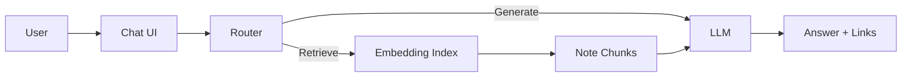

---
{"dg-publish":true,"permalink":"/content/mathnuscripts/ai-assistant-mathnuscripts/","noteIcon":"2"}
---

# AI Assistant (Mathnuscripts)

Design for “Ask Mathenge” and RAG over the vault.

## Capabilities
- Natural-language Q&A over vault + essays
- Suggest related notes and reading paths
- Draft essays from clustered topics

## High-level Design

## Sources
- [[Content/Projects/Mathnuscripts\|Mathnuscripts]]
- [[Content/Home\|Home]]
- [[Fleeting Notes/Digital Mind\|Digital Mind]]
- [[Content/Mathnuscripts/Publishing (Mathnuscripts)\|Publishing (Mathnuscripts)]]

