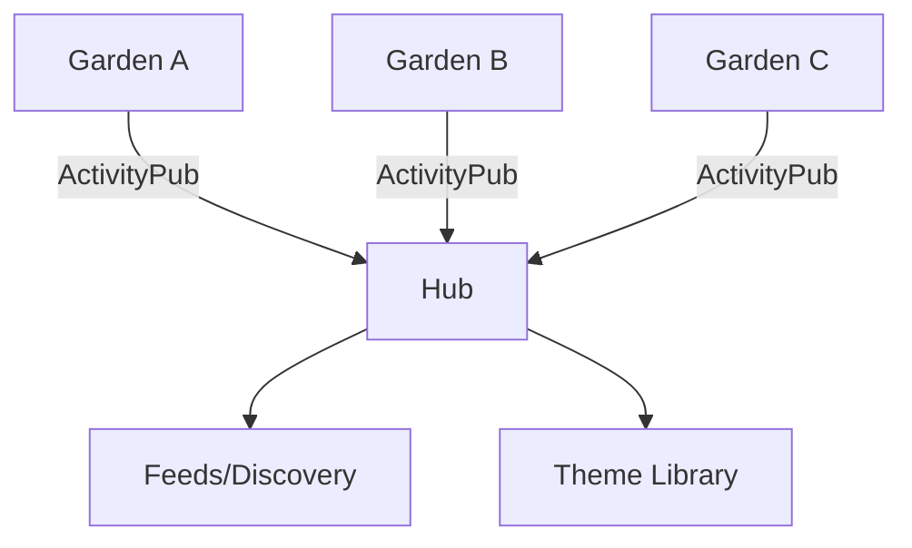

---
{"dg-publish":true,"permalink":"/content/mathnuscripts/garden-network-mathnuscripts/","noteIcon":"2"}
---

# Garden Network (Mathnuscripts)

Concept for a network of personal digital gardens.

## Principles
- Own your notes, share your garden
- Interoperate via open protocols (ActivityPub)
- Curate themes and recommendations

## Concept Diagram

## References
- [[Fleeting Notes/Mathnuscripts Master Plan\|Mathnuscripts Master Plan]]
- [[Content/Mathnuscripts/Publishing (Mathnuscripts)\|Publishing (Mathnuscripts)]]

