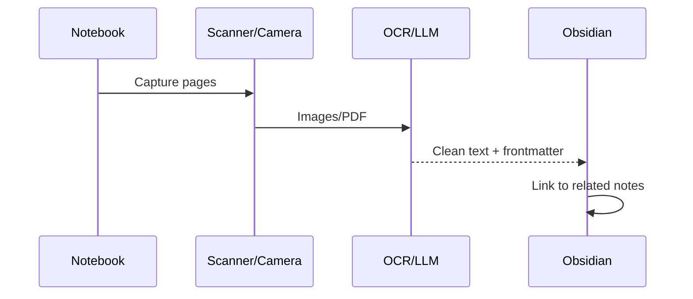

---
{"dg-publish":true,"permalink":"/content/mathnuscripts/handwritten-to-digital-mathnuscripts/","noteIcon":"2"}
---

# Handwritten to Digital (Mathnuscripts)

Approaches and workflow for converting notebooks to searchable notes.

## Methods
- Scan to PDF → OCR → Import
- Voice read-through → STT transcript → Summarise
- Smart pens / digital notebooks
- Telegram → LLM transcription → Obsidian note

## Workflow

## References
- [[Projects/Turning Handwritten Notes to Digital Notes\|Turning Handwritten Notes to Digital Notes]]
- [[Content/Projects/Problems to Solve\|Problems to Solve]]
- [[Fleeting Notes/Building My Knowledge Base\|Building My Knowledge Base]]

