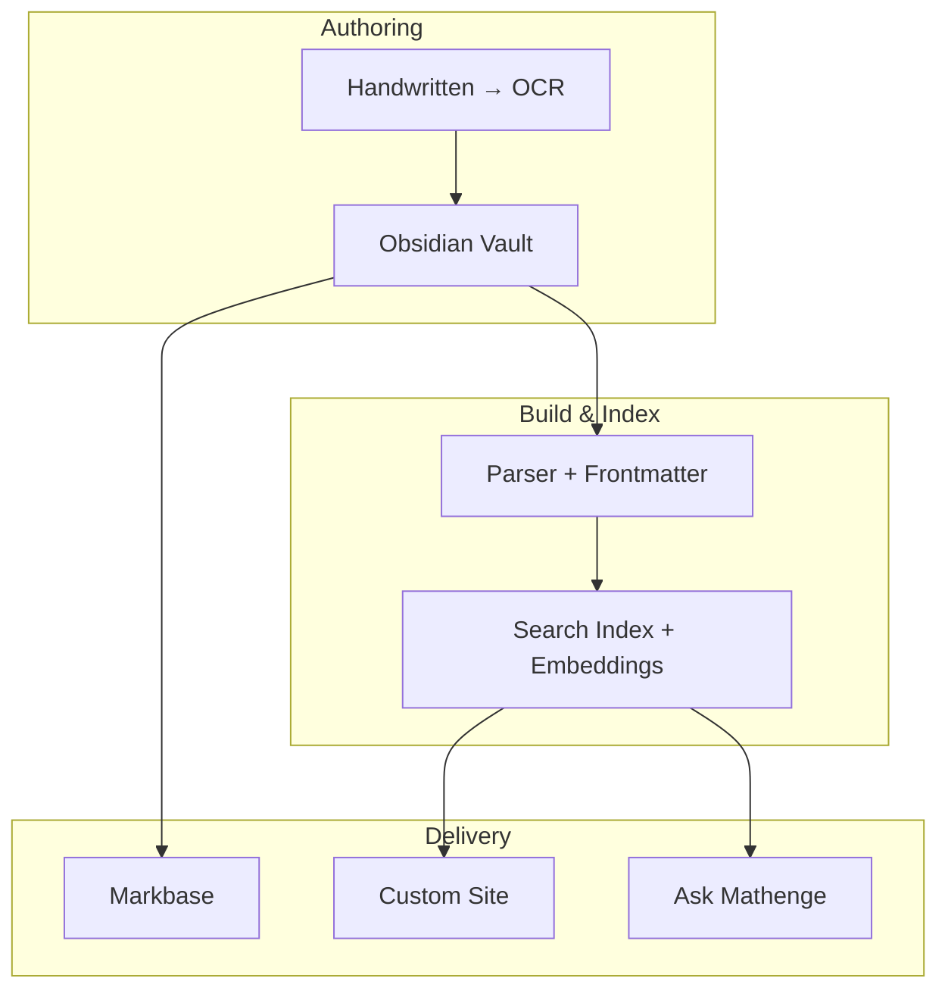

---
{"dg-publish":true,"permalink":"/content/mathnuscripts/publishing-mathnuscripts/","noteIcon":"2"}
---

# Publishing (Mathnuscripts)

Centralised view of publishing across Markbase and a custom site.

## Current
- Markbase: `https://mathnuscripts.markbase.xyz/Home`
- Obsidian Digital Garden plugin for hosting

## Target Architecture

## Links
- [[Fleeting Notes/Publishing My Second Brain\|Publishing My Second Brain]]
- [[Content/Projects/Mathnuscripts\|Mathnuscripts]]
- [[Content/Home\|Home]]

