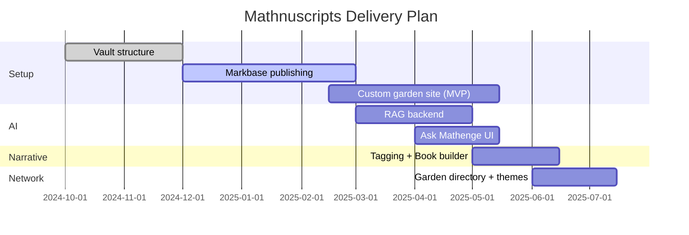

---
{"dg-publish":true,"permalink":"/content/mathnuscripts/roadmap-mathnuscripts/","noteIcon":"2"}
---

# Roadmap (Mathnuscripts)

Derived from `Content/Projects/Mathnuscripts.md` and `Fleeting Notes/Mathnuscripts Master Plan.md`.

## Phases
1. Setup & Publishing
   - Obsidian vault structure
   - Publish via Markbase; plan custom site
2. AI & Digital Assistant
   - RAG over notes and essays
   - “Ask Mathenge” interface
   - Weekly summaries of vault topics
3. Narrative Packaging
   - Tag by narrative themes
   - Book builder; short video pipeline
4. Garden Network
   - Open-source publishing template
   - Directory, themes, ActivityPub

## Now → Next → Later

## Dependencies
- [[Fleeting Notes/Digital Mind\|Digital Mind]]
- [[Content/Mathnuscripts/Publishing (Mathnuscripts)\|Publishing (Mathnuscripts)]]
- [[Content/Mathnuscripts/AI Assistant (Mathnuscripts)\|AI Assistant (Mathnuscripts)]]

